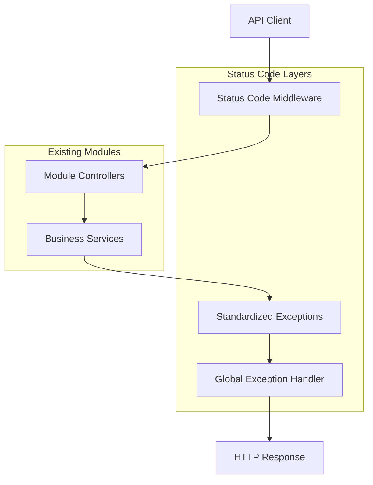

# Design Document: HTTP Status Codes Standardization

## Overview

This document defines the technical design for implementing standardized HTTP status codes across all 55 API endpoints in the Inventory Management System (IMS). The implementation will establish consistent status code patterns for success scenarios, client errors, server errors, and business logic violations while maintaining backward compatibility with existing API consumers.

The design addresses the current gap where endpoints lack formal status code specifications, making it difficult for client developers to implement proper error handling and for system administrators to monitor API health effectively.

## Architecture

### High-Level Architecture

The HTTP status code standardization will be implemented through a layered approach that integrates with the existing modular monolith architecture:



### Integration Points

The status code standardization integrates with existing system components:

1. **Laravel Exception Handling**: Extends the existing exception handler to map business exceptions to appropriate HTTP status codes
2. **Module Controllers**: Updates all controllers across 4 modules (Inventory, Procurement, Reporting, User Management) 
3. **API Documentation**: Enhances existing OpenAPI/Swagger documentation with comprehensive status code specifications
4. **Middleware Stack**: Adds status code validation and logging middleware to the existing authentication/authorization stack

### Status Code Categories

The implementation follows RFC 7231 HTTP status code semantics organized into four categories:

| Category | Range | Usage in IMS | Examples |
|----------|-------|-------------|----------|
| Success | 2xx | Successful operations | 200 (GET), 201 (POST create), 204 (DELETE) |
| Redirection | 3xx | Not used in REST API | N/A |
| Client Error | 4xx | Invalid requests, auth failures | 400, 401, 403, 404, 409, 422 |
| Server Error | 5xx | System failures, timeouts | 500, 503, 504 |

## Components and Interfaces

### 1. Exception Hierarchy

A new exception hierarchy provides consistent mapping between business logic errors and HTTP status codes:

```php
// Base exception with status code mapping
abstract class ApiException extends Exception
{
    abstract public function getStatusCode(): int;
    abstract public function getErrorCode(): string;
    public function getContext(): array { return []; }
}

// Client error exceptions (4xx)
class ValidationException extends ApiException
{
    public function getStatusCode(): int { return 422; }
    public function getErrorCode(): string { return 'VALIDATION_FAILED'; }
}

class ResourceNotFoundException extends ApiException
{
    public function getStatusCode(): int { return 404; }
    public function getErrorCode(): string { return 'RESOURCE_NOT_FOUND'; }
}

class ConflictException extends ApiException
{
    public function getStatusCode(): int { return 409; }
    public function getErrorCode(): string { return 'RESOURCE_CONFLICT'; }
}

// Server error exceptions (5xx)
class ServiceUnavailableException extends ApiException
{
    public function getStatusCode(): int { return 503; }
    public function getErrorCode(): string { return 'SERVICE_UNAVAILABLE'; }
}
```

### 2. Status Code Service

A centralized service manages status code logic and provides consistent response formatting:

```php
class StatusCodeService
{
    public function successResponse($data, int $statusCode = 200): JsonResponse
    {
        return response()->json([
            'success' => true,
            'data' => $data,
            'timestamp' => now()->toISOString()
        ], $statusCode);
    }
    
    public function errorResponse(
        string $message, 
        int $statusCode, 
        string $errorCode,
        array $context = []
    ): JsonResponse
    {
        return response()->json([
            'success' => false,
            'error' => [
                'code' => $errorCode,
                'message' => $message,
                'context' => $context
            ],
            'timestamp' => now()->toISOString()
        ], $statusCode);
    }
    
    public function validateStatusCode(int $statusCode): bool
    {
        return in_array($statusCode, $this->getAllowedStatusCodes());
    }
    
    private function getAllowedStatusCodes(): array
    {
        return [200, 201, 204, 400, 401, 403, 404, 405, 409, 413, 422, 500, 503, 504];
    }
}
```

### 3. Enhanced Exception Handler

The global exception handler maps business exceptions to appropriate HTTP status codes:

```php
class Handler extends ExceptionHandler
{
    protected function render($request, Throwable $exception)
    {
        // Handle API exceptions with proper status codes
        if ($exception instanceof ApiException) {
            return app(StatusCodeService::class)->errorResponse(
                $exception->getMessage(),
                $exception->getStatusCode(),
                $exception->getErrorCode(),
                $exception->getContext()
            );
        }
        
        // Handle Laravel validation exceptions
        if ($exception instanceof ValidationException) {
            return app(StatusCodeService::class)->errorResponse(
                'The given data was invalid.',
                422,
                'VALIDATION_FAILED',
                ['errors' => $exception->errors()]
            );
        }
        
        // Handle authentication exceptions
        if ($exception instanceof AuthenticationException) {
            return app(StatusCodeService::class)->errorResponse(
                'Unauthenticated.',
                401,
                'UNAUTHENTICATED'
            );
        }
        
        // Handle authorization exceptions
        if ($exception instanceof AuthorizationException) {
            return app(StatusCodeService::class)->errorResponse(
                'This action is unauthorized.',
                403,
                'UNAUTHORIZED'
            );
        }
        
        // Handle model not found
        if ($exception instanceof ModelNotFoundException) {
            return app(StatusCodeService::class)->errorResponse(
                'Resource not found.',
                404,
                'RESOURCE_NOT_FOUND'
            );
        }
        
        // Default server error for unhandled exceptions
        return app(StatusCodeService::class)->errorResponse(
            'Internal server error.',
            500,
            'INTERNAL_SERVER_ERROR'
        );
    }
}
```

### 4. Controller Response Patterns

Standardized response patterns for controllers across all modules:

```php
// Base controller with status code methods
abstract class BaseController extends Controller
{
    protected StatusCodeService $statusCodeService;
    
    public function __construct(StatusCodeService $statusCodeService)
    {
        $this->statusCodeService = $statusCodeService;
    }
    
    // Success responses
    protected function success($data, int $statusCode = 200): JsonResponse
    {
        return $this->statusCodeService->successResponse($data, $statusCode);
    }
    
    protected function created($data): JsonResponse
    {
        return $this->statusCodeService->successResponse($data, 201);
    }
    
    protected function noContent(): JsonResponse
    {
        return response()->json(null, 204);
    }
    
    // Error responses
    protected function badRequest(string $message, array $context = []): JsonResponse
    {
        return $this->statusCodeService->errorResponse($message, 400, 'BAD_REQUEST', $context);
    }
    
    protected function notFound(string $message = 'Resource not found'): JsonResponse
    {
        return $this->statusCodeService->errorResponse($message, 404, 'RESOURCE_NOT_FOUND');
    }
    
    protected function conflict(string $message, array $context = []): JsonResponse
    {
        return $this->statusCodeService->errorResponse($message, 409, 'RESOURCE_CONFLICT', $context);
    }
}
```

### 5. Middleware Integration

Status code logging and validation middleware:

```php
class StatusCodeMiddleware
{
    public function handle(Request $request, Closure $next)
    {
        $response = $next($request);
        
        // Log status codes for monitoring
        Log::info('API Response', [
            'endpoint' => $request->getPathInfo(),
            'method' => $request->getMethod(),
            'status_code' => $response->getStatusCode(),
            'user_id' => auth()->id(),
            'timestamp' => now()
        ]);
        
        return $response;
    }
}
```

## Data Models

### Status Code Documentation Schema

The implementation extends the existing API documentation structure:

```json
{
  "endpoint": "/api/v1/products/{id}",
  "method": "GET",
  "statusCodes": {
    "success": {
      "200": {
        "description": "Product retrieved successfully",
        "schema": { "$ref": "#/components/schemas/Product" }
      }
    },
    "clientError": {
      "401": {
        "description": "Authentication required",
        "schema": { "$ref": "#/components/schemas/Error" }
      },
      "403": {
        "description": "Insufficient permissions",
        "schema": { "$ref": "#/components/schemas/Error" }
      },
      "404": {
        "description": "Product not found",
        "schema": { "$ref": "#/components/schemas/Error" }
      }
    },
    "serverError": {
      "500": {
        "description": "Internal server error",
        "schema": { "$ref": "#/components/schemas/Error" }
      },
      "503": {
        "description": "Database unavailable",
        "schema": { "$ref": "#/components/schemas/Error" }
      }
    }
  }
}
```

### Error Response Schema

Standardized error response format across all endpoints:

```json
{
  "success": false,
  "error": {
    "code": "VALIDATION_FAILED",
    "message": "The given data was invalid.",
    "context": {
      "errors": {
        "name": ["The name field is required."],
        "quantity": ["The quantity must be a positive integer."]
      }
    }
  },
  "timestamp": "2024-01-15T10:30:00.000Z"
}
```

### Success Response Schema

Standardized success response format:

```json
{
  "success": true,
  "data": {
    "id": 123,
    "name": "Widget A",
    "quantity": 50
  },
  "timestamp": "2024-01-15T10:30:00.000Z"
}
```

## Correctness Properties

*A property is a characteristic or behavior that should hold true across all valid executions of a system—essentially, a formal statement about what the system should do. Properties serve as the bridge between human-readable specifications and machine-verifiable correctness guarantees.*

### Property 1: Authentication Required Endpoints Return 401 for Missing Credentials

*For all* endpoints that require authentication, when a request is made without authentication credentials, the endpoint SHALL return HTTP status code 401.

**Validates: Requirements 10.3**

### Property 2: Role-Restricted Endpoints Return 403 for Unauthorized Access

*For all* endpoints with role restrictions, when a request is made by a user with insufficient role permissions, the endpoint SHALL return HTTP status code 403.

**Validates: Requirements 10.4**

### Property 3: Request Body Endpoints Return 422 for Invalid Data

*For all* endpoints that accept request bodies, when a request is made with invalid data that fails validation rules, the endpoint SHALL return HTTP status code 422.

**Validates: Requirements 10.5**

## Error Handling

The error handling strategy implements a comprehensive approach to map all possible system states to appropriate HTTP status codes while maintaining consistency and debuggability.

### Error Categories and Mapping

#### Authentication and Authorization Errors

| Error Condition | Status Code | Error Code | Response Format |
|----------------|-------------|------------|------------------|
| Missing JWT token | 401 | `UNAUTHENTICATED` | `{"success": false, "error": {"code": "UNAUTHENTICATED", "message": "Authentication required"}}` |
| Invalid JWT token | 401 | `UNAUTHENTICATED` | `{"success": false, "error": {"code": "UNAUTHENTICATED", "message": "Invalid authentication credentials"}}` |
| Expired JWT token | 401 | `TOKEN_EXPIRED` | `{"success": false, "error": {"code": "TOKEN_EXPIRED", "message": "Authentication token has expired"}}` |
| Insufficient permissions | 403 | `UNAUTHORIZED` | `{"success": false, "error": {"code": "UNAUTHORIZED", "message": "Insufficient permissions for this operation"}}` |
| Role mismatch | 403 | `ROLE_MISMATCH` | `{"success": false, "error": {"code": "ROLE_MISMATCH", "message": "User role does not permit this action"}}` |

#### Validation and Client Errors

| Error Condition | Status Code | Error Code | Response Format |
|----------------|-------------|------------|------------------|
| Required field missing | 422 | `VALIDATION_FAILED` | Include field-specific error details |
| Invalid data type | 422 | `VALIDATION_FAILED` | Include type mismatch details |
| Business rule violation | 422 | `BUSINESS_RULE_VIOLATION` | Include rule-specific context |
| Resource not found | 404 | `RESOURCE_NOT_FOUND` | Include resource type and identifier |
| Resource conflict | 409 | `RESOURCE_CONFLICT` | Include conflict details |
| Method not allowed | 405 | `METHOD_NOT_ALLOWED` | Include allowed methods |
| Payload too large | 413 | `PAYLOAD_TOO_LARGE` | Include size limits |

#### Server and Infrastructure Errors

| Error Condition | Status Code | Error Code | Response Format |
|----------------|-------------|------------|------------------|
| Database connection failure | 503 | `DATABASE_UNAVAILABLE` | Generic message (no internal details) |
| External service timeout | 504 | `GATEWAY_TIMEOUT` | Service-agnostic error message |
| External service unavailable | 503 | `SERVICE_UNAVAILABLE` | Generic service error |
| Unexpected system error | 500 | `INTERNAL_SERVER_ERROR` | Generic error message with request ID |

### Error Response Consistency

All error responses follow a standardized format:

```json
{
  "success": false,
  "error": {
    "code": "ERROR_CODE_CONSTANT",
    "message": "Human-readable error description",
    "context": {
      "field": "specific_error_details",
      "request_id": "uuid-for-tracking"
    }
  },
  "timestamp": "2024-01-15T10:30:00.000Z"
}
```

### Business Logic Error Handling

Special handling for IMS-specific business rules:

#### Inventory Operations
- Stock out exceeding available quantity → 409 `INSUFFICIENT_INVENTORY`
- Operations on expired batches → 422 `EXPIRED_BATCH_OPERATION`
- FEFO violations → 409 `FEFO_VIOLATION`

#### Procurement Operations
- Purchase order state violations → 409 `INVALID_PO_STATE`
- Supplier relationship conflicts → 409 `SUPPLIER_CONFLICT`

#### Reservation System
- Double booking attempts → 409 `RESERVATION_CONFLICT`
- Operations on expired reservations → 422 `EXPIRED_RESERVATION`

### Error Logging and Monitoring

All errors are logged with appropriate detail levels:

```php
// Client errors (4xx) - INFO level
Log::info('Client Error', [
    'status_code' => $statusCode,
    'error_code' => $errorCode,
    'endpoint' => $request->getPathInfo(),
    'user_id' => auth()->id(),
    'context' => $context
]);

// Server errors (5xx) - ERROR level with full trace
Log::error('Server Error', [
    'status_code' => $statusCode,
    'error_code' => $errorCode,
    'endpoint' => $request->getPathInfo(),
    'exception' => $exception->__toString(),
    'trace' => $exception->getTraceAsString()
]);
```

## Testing Strategy

The testing strategy employs a dual approach combining property-based testing for universal behaviors and comprehensive example-based testing for specific scenarios.

### Property-Based Testing

**Library**: PHPUnit with custom generators for IMS-specific data types
**Configuration**: Minimum 100 iterations per property test
**Coverage**: Universal behaviors that must hold across all valid inputs

#### Property Test Implementation

```php
class StatusCodePropertyTest extends TestCase
{
    /** @test */
    public function authenticated_endpoints_return_401_for_missing_credentials()
    {
        // Property: For all authenticated endpoints, missing credentials → 401
        $authenticatedEndpoints = $this->getAuthenticatedEndpoints();
        
        foreach ($authenticatedEndpoints as $endpoint) {
            $response = $this->withoutAuthentication()
                ->call($endpoint['method'], $endpoint['path']);
            
            $this->assertEquals(401, $response->getStatusCode(), 
                "Endpoint {$endpoint['method']} {$endpoint['path']} should return 401 for missing credentials");
        }
    }
    
    /** @test */
    public function role_restricted_endpoints_return_403_for_unauthorized_access()
    {
        // Property: For all role-restricted endpoints, insufficient permissions → 403
        $roleEndpoints = $this->getRoleRestrictedEndpoints();
        
        foreach ($roleEndpoints as $endpoint) {
            $unauthorizedUser = $this->createUserWithRole($this->getInsufficientRole($endpoint['required_role']));
            
            $response = $this->actingAs($unauthorizedUser)
                ->call($endpoint['method'], $endpoint['path']);
                
            $this->assertEquals(403, $response->getStatusCode(),
                "Endpoint {$endpoint['method']} {$endpoint['path']} should return 403 for role {$unauthorizedUser->role}");
        }
    }
    
    /** @test */
    public function endpoints_with_request_bodies_return_422_for_invalid_data()
    {
        // Property: For all endpoints accepting request bodies, invalid data → 422
        $bodyEndpoints = $this->getEndpointsWithRequestBodies();
        
        foreach ($bodyEndpoints as $endpoint) {
            $invalidData = $this->generateInvalidDataFor($endpoint['validation_rules']);
            
            $response = $this->actingAs($this->createValidUser())
                ->postJson($endpoint['path'], $invalidData);
                
            $this->assertEquals(422, $response->getStatusCode(),
                "Endpoint {$endpoint['method']} {$endpoint['path']} should return 422 for invalid data");
        }
    }
}
```

**Tag Format**: 
- **Feature: http-status-codes, Property 1**: Authentication Required Endpoints Return 401 for Missing Credentials
- **Feature: http-status-codes, Property 2**: Role-Restricted Endpoints Return 403 for Unauthorized Access  
- **Feature: http-status-codes, Property 3**: Request Body Endpoints Return 422 for Invalid Data

### Unit and Integration Testing

**Documentation Verification Tests**: Single-execution tests verifying API documentation completeness and accuracy for all 55 endpoints across 4 modules.

**Specific Scenario Tests**: Example-based tests for business logic scenarios:

```php
class StatusCodeExampleTest extends TestCase
{
    /** @test */
    public function stock_out_exceeding_inventory_returns_409()
    {
        $product = Product::factory()->create(['quantity' => 10]);
        
        $response = $this->actingAs($this->inventoryUser())
            ->postJson('/api/v1/stock-out', [
                'product_id' => $product->id,
                'quantity' => 15  // Exceeds available
            ]);
            
        $this->assertEquals(409, $response->getStatusCode());
        $this->assertEquals('INSUFFICIENT_INVENTORY', $response->json('error.code'));
    }
    
    /** @test */
    public function pagination_beyond_available_data_returns_200_with_empty_results()
    {
        Product::factory()->count(5)->create();
        
        $response = $this->actingAs($this->anyUser())
            ->getJson('/api/v1/products?page=10&per_page=10');
            
        $this->assertEquals(200, $response->getStatusCode());
        $this->assertEmpty($response->json('data'));
    }
}
```

### Test Coverage Requirements

| Category | Coverage Target | Verification Method |
|----------|----------------|---------------------|
| Success Status Codes | 100% of endpoints | Example-based tests for each HTTP method pattern |
| Authentication Failures | 100% of protected endpoints | Property-based test across all authenticated endpoints |
| Authorization Failures | 100% of role-restricted endpoints | Property-based test across all role restrictions |
| Validation Failures | 100% of endpoints with request bodies | Property-based test with invalid data generation |
| Business Logic Conflicts | All documented scenarios | Example-based tests for each business rule |
| Infrastructure Errors | Core error conditions | Mock-based tests simulating failure conditions |

### Test Data Generation

Custom generators for IMS-specific scenarios:

```php
class IMSDataGenerator
{
    public function generateInvalidProductData(): array
    {
        return [
            'name' => '', // Required field empty
            'quantity' => -5, // Invalid negative quantity
            'unit_price' => 'invalid', // Invalid data type
            'category_id' => 999999 // Non-existent foreign key
        ];
    }
    
    public function generateRolePermissionMatrix(): array
    {
        return [
            'warehouse' => ['POST /stock-out', 'GET /fefo-recommendations'],
            'inventory' => ['POST /products', 'PATCH /products/{id}', 'POST /reservations'],
            'manager' => ['POST /users', 'GET /reports/inventory', 'PATCH /purchase-orders/{id}/approve']
        ];
    }
}
```

## Implementation Plan

### Phase 1: Foundation Layer (Week 1)

**Objective**: Establish the core infrastructure for status code standardization

**Tasks**:
1. Create the exception hierarchy and base `ApiException` class
2. Implement the `StatusCodeService` with standardized response methods
3. Update the global exception handler to map exceptions to status codes
4. Create the `BaseController` with standard response methods
5. Implement status code logging middleware

**Deliverables**:
- Exception classes for all standard HTTP error scenarios
- Service class for consistent response formatting
- Enhanced exception handler with status code mapping
- Base controller with response helper methods
- Middleware for status code logging and validation

### Phase 2: Module Integration (Week 2-3)

**Objective**: Update all controllers across the 4 modules to use standardized status codes

**Tasks by Module**:

#### User Management Module (7 endpoints)
- Update `AuthController` for 401/403 responses
- Update `UserController` for CRUD operations status codes
- Implement role-based 403 responses

#### Inventory Module (27 endpoints) 
- Update product, batch, and stock transaction controllers
- Implement business logic conflict handling (409 responses)
- Add validation error handling (422 responses)
- Update reservation and count controllers

#### Procurement Module (13 endpoints)
- Update supplier and purchase order controllers  
- Implement approval workflow status codes
- Add procurement-specific business rule responses

#### Reporting Module (5 endpoints)
- Update dashboard and report controllers
- Implement appropriate success responses
- Add error handling for report generation failures

### Phase 3: Documentation and Testing (Week 4)

**Objective**: Complete API documentation and implement comprehensive test coverage

**Tasks**:
1. Update OpenAPI/Swagger documentation with all status codes
2. Implement property-based tests for universal behaviors
3. Create example-based tests for specific business scenarios
4. Add documentation verification tests
5. Implement monitoring and alerting for status code patterns

**Documentation Updates**:
- Add status code sections to all 55 endpoint definitions
- Include response schemas for all error conditions
- Provide example payloads for each status code
- Group status codes by category (Success, Client Error, Server Error)

### Phase 4: Validation and Rollout (Week 5)

**Objective**: Validate implementation and prepare for production deployment

**Tasks**:
1. Execute comprehensive test suite (property + example tests)
2. Perform API documentation validation
3. Conduct integration testing with existing client applications
4. Implement status code monitoring dashboards
5. Prepare rollback procedures

**Validation Checklist**:
- [ ] All 55 endpoints have documented status codes
- [ ] Property tests pass for authentication, authorization, and validation
- [ ] Example tests cover all business logic scenarios
- [ ] API documentation matches implementation
- [ ] Existing client applications remain compatible
- [ ] Monitoring dashboards track status code distributions

## Rollout Strategy

### Backward Compatibility

The implementation maintains backward compatibility with existing API consumers:

1. **Response Format**: Existing successful response structures remain unchanged
2. **Status Codes**: Current successful operations continue returning the same status codes
3. **Error Handling**: Enhanced error responses provide additional detail without breaking existing error parsing
4. **API Versioning**: Changes are implemented within the current API version (v1)

### Feature Flags

Use Laravel's feature flag system to enable gradual rollout:

```php
// Gradual rollout by module
if (Feature::active('enhanced-status-codes.user-management')) {
    // Use new status code patterns
    return $this->statusCodeService->errorResponse(...);
}

// Fallback to legacy behavior
return response()->json(['error' => 'Legacy error format'], 500);
```

### Monitoring and Rollback

**Status Code Monitoring**:
- Track distribution of status codes by endpoint
- Alert on unexpected status code patterns
- Monitor error rate changes during rollout

**Rollback Triggers**:
- Client application errors increase >10%
- Unexpected status code distributions  
- Integration test failures in production

**Rollback Process**:
1. Disable feature flags for affected modules
2. Revert to previous exception handling patterns
3. Monitor error rates return to baseline
4. Investigate and fix issues before retry

## Success Metrics

### Implementation Success

| Metric | Target | Measurement |
|--------|--------|-------------|
| API Documentation Coverage | 100% of 55 endpoints have status code definitions | Documentation audit |
| Test Coverage | 100% property test pass rate | Automated test execution |
| Response Consistency | All error responses follow standard format | Response schema validation |

### Operational Success  

| Metric | Target | Measurement |
|--------|--------|-------------|
| Client Error Reduction | <5% client applications report status code issues | Client feedback tracking |
| Debugging Efficiency | 50% reduction in API support tickets | Support ticket analysis |
| Integration Success | Zero integration failures during rollout | Integration test monitoring |

### Long-term Success

| Metric | Target | Measurement |
|--------|--------|-------------|
| Developer Adoption | New API integrations use standard error handling | Code review metrics |
| System Reliability | Status code patterns align with system health | Monitoring correlation |
| Documentation Usage | API documentation becomes primary reference | Documentation analytics |

## Maintenance and Evolution

### Status Code Governance

1. **New Status Codes**: Require architecture review for any new HTTP status code introduction
2. **Business Rules**: Map new business logic errors to existing status code patterns where possible
3. **Documentation**: Maintain documentation synchronization with implementation changes

### Future Enhancements

1. **API Versioning**: Prepare framework for future API versions with enhanced status code patterns
2. **OpenAPI Integration**: Automated validation of implementation against OpenAPI specifications
3. **Client SDK Generation**: Use standardized status codes for automatic client library generation

## Frontend Integration

### React SPA Status Code Handling

The React frontend (React + JavaScript + Vite + Tailwind CSS) requires comprehensive integration with the standardized HTTP status codes to provide proper user feedback and maintain application state consistency.

#### Current Frontend Architecture Context

The existing frontend architecture uses:
- **API Client**: `api/client.js` with fetch wrapper that handles authentication and base URL configuration
- **Module-specific API Files**: `auth.js`, `inventory.js`, `procurement.js`, `reporting.js` that wrap the API client
- **Current Error Handling**: Throws on non-OK responses and handles 401 by clearing token and redirecting to `/login`
- **Authentication Hook**: `useAuth` hook manages authentication state
- **Local State Management**: Per-component state with `useState`/`useEffect` for server data (no React Query yet)

### Enhanced API Client

Update the existing `api/client.js` to handle all standardized status codes:

```javascript
// api/errors.js - Enhanced API client error classes
/**
 * Base API error class
 * @param {number} statusCode - HTTP status code
 * @param {string} errorCode - Application error code
 * @param {Object} [context] - Additional error context
 * @param {string} [message] - Error message
 */
class ApiError extends Error {
  constructor(statusCode, errorCode, context, message) {
    super(message || `HTTP ${statusCode}: ${errorCode}`);
    this.name = 'ApiError';
    this.statusCode = statusCode;
    this.errorCode = errorCode;
    this.context = context;
  }
}

/**
 * Validation error for 422 responses
 * @param {Object} validationErrors - Field validation errors
 * @param {string} [message] - Error message
 */
class ValidationError extends ApiError {
  constructor(validationErrors, message) {
    super(422, 'VALIDATION_FAILED', { errors: validationErrors }, message);
    this.name = 'ValidationError';
    this.validationErrors = validationErrors;
  }
}

/**
 * Authentication error for 401 responses
 * @param {string} [message] - Error message
 */
class AuthenticationError extends ApiError {
  constructor(message) {
    super(401, 'UNAUTHENTICATED', undefined, message);
    this.name = 'AuthenticationError';
  }
}

/**
 * Authorization error for 403 responses
 * @param {string} [message] - Error message
 */
class AuthorizationError extends ApiError {
  constructor(message) {
    super(403, 'UNAUTHORIZED', undefined, message);
    this.name = 'AuthorizationError';
  }
}

/**
 * Not found error for 404 responses
 * @param {string} [resource] - Resource that was not found
 */
class NotFoundError extends ApiError {
  constructor(resource) {
    super(404, 'RESOURCE_NOT_FOUND', { resource }, 
      `${resource || 'Resource'} not found`);
    this.name = 'NotFoundError';
  }
}

/**
 * Conflict error for 409 responses
 * @param {string} [message] - Error message
 * @param {Object} [context] - Additional context
 */
class ConflictError extends ApiError {
  constructor(message, context) {
    super(409, 'RESOURCE_CONFLICT', context, message);
    this.name = 'ConflictError';
  }
}

/**
 * Server error for 5xx responses
 * @param {string} [message] - Error message
 * @param {Object} [context] - Additional context
 */
class ServerError extends ApiError {
  constructor(message, context) {
    super(500, 'INTERNAL_SERVER_ERROR', context, message);
    this.name = 'ServerError';
  }
}

export {
  ApiError,
  ValidationError,
  AuthenticationError,
  AuthorizationError,
  NotFoundError,
  ConflictError,
  ServerError,
};
```

#### Enhanced API Client Implementation

```javascript
// api/client.js - Enhanced client with comprehensive error handling
import {
  ApiError,
  ValidationError,
  AuthenticationError,
  AuthorizationError,
  NotFoundError,
  ConflictError,
  ServerError,
} from './errors.js';

class ApiClient {
  constructor() {
    this.baseURL = import.meta.env.VITE_API_BASE_URL || 'http://localhost:8000/api';
  }

  /**
   * Get authentication token from localStorage
   * @returns {string|null} JWT token or null
   */
  getAuthToken() {
    return localStorage.getItem('ims_token');
  }

  /**
   * Clear authentication token from localStorage
   */
  clearAuthToken() {
    localStorage.removeItem('ims_token');
  }

  /**
   * Handle API response and convert errors to appropriate error classes
   * @param {Response} response - Fetch response object
   * @returns {Promise<any>} Response data
   */
  async handleResponse(response) {
    const contentType = response.headers.get('content-type');
    const hasJson = contentType?.includes('application/json');
    
    if (!hasJson) {
      throw new ServerError('Invalid response format from server');
    }

    const data = await response.json();

    if (response.ok && data.success) {
      return data.data;
    }

    // Handle error responses with standardized format
    if (!data.success && data.error) {
      const { error } = data;
      
      switch (response.status) {
        case 400:
          throw new ApiError(400, error.code, error.context, error.message);
        
        case 401:
          this.clearAuthToken();
          window.location.href = '/login';
          throw new AuthenticationError(error.message);
        
        case 403:
          throw new AuthorizationError(error.message);
        
        case 404:
          throw new NotFoundError(error.context?.resource);
        
        case 409:
          throw new ConflictError(error.message, error.context);
        
        case 422:
          throw new ValidationError(
            error.context?.errors || {},
            error.message
          );
        
        case 413:
          throw new ApiError(413, error.code, error.context, error.message);
        
        case 500:
          throw new ServerError(error.message, error.context);
        
        case 503:
          throw new ApiError(503, error.code, error.context, 
            'Service temporarily unavailable. Please try again later.');
        
        case 504:
          throw new ApiError(504, error.code, error.context,
            'Request timeout. Please try again.');
        
        default:
          throw new ApiError(
            response.status,
            error.code || 'UNKNOWN_ERROR',
            error.context,
            error.message || 'An unexpected error occurred'
          );
      }
    }

    // Fallback for non-standard error responses
    throw new ServerError(`HTTP ${response.status}: ${response.statusText}`);
  }

  /**
   * Make HTTP request to API endpoint
   * @param {string} method - HTTP method
   * @param {string} endpoint - API endpoint path
   * @param {any} [body] - Request body
   * @returns {Promise<any>} Response data
   */
  async request(method, endpoint, body) {
    const url = `${this.baseURL}${endpoint}`;
    const token = this.getAuthToken();

    const config = {
      method,
      headers: {
        'Content-Type': 'application/json',
        'Accept': 'application/json',
        ...(token && { Authorization: `Bearer ${token}` }),
      },
    };

    if (body && method !== 'GET') {
      config.body = JSON.stringify(body);
    }

    try {
      const response = await fetch(url, config);
      return await this.handleResponse(response);
    } catch (error) {
      if (error instanceof ApiError) {
        throw error;
      }
      
      // Network or other fetch errors
      throw new ServerError(
        'Network error or server unavailable',
        { originalError: error.message }
      );
    }
  }

  /**
   * Make GET request
   * @param {string} endpoint - API endpoint path
   * @returns {Promise<any>} Response data
   */
  async get(endpoint) {
    return this.request('GET', endpoint);
  }

  /**
   * Make POST request
   * @param {string} endpoint - API endpoint path
   * @param {any} [body] - Request body
   * @returns {Promise<any>} Response data
   */
  async post(endpoint, body) {
    return this.request('POST', endpoint, body);
  }

  /**
   * Make PATCH request
   * @param {string} endpoint - API endpoint path
   * @param {any} [body] - Request body
   * @returns {Promise<any>} Response data
   */
  async patch(endpoint, body) {
    return this.request('PATCH', endpoint, body);
  }

  /**
   * Make DELETE request
   * @param {string} endpoint - API endpoint path
   * @returns {Promise<any>} Response data
   */
  async delete(endpoint) {
    return this.request('DELETE', endpoint);
  }
}

export const apiClient = new ApiClient();
export {
  ApiError,
  ValidationError,
  AuthenticationError,
  AuthorizationError,
  NotFoundError,
  ConflictError,
  ServerError,
} from './errors.js';
```

### Error Handling Patterns for React Components

#### Error State Management Hook

```javascript
// hooks/useApiError.js - Centralized error handling
import { useState, useCallback } from 'react';
import { ApiError, ServerError } from '../api/errors.js';

/**
 * Hook for managing API error state
 * @returns {Object} Error state and handlers
 */
export const useApiError = () => {
  const [error, setError] = useState(null);
  const [isLoading, setIsLoading] = useState(false);

  const clearError = useCallback(() => {
    setError(null);
  }, []);

  const handleError = useCallback((error) => {
    setIsLoading(false);
    
    if (error instanceof ApiError) {
      setError(error);
    } else {
      setError(new ServerError('An unexpected error occurred'));
    }
  }, []);

  return {
    error,
    isLoading,
    clearError,
    handleError,
  };
};
```

#### Error Display Component

```jsx
// components/common/ErrorAlert.jsx - Standardized error display
import React from 'react';

/**
 * Display API errors with appropriate styling and actions
 * @param {Object} props
 * @param {ApiError} props.error - The error to display
 * @param {Function} [props.onDismiss] - Dismiss handler
 * @param {boolean} [props.showDetails] - Whether to show error details
 */
export const ErrorAlert = ({ error, onDismiss, showDetails = false }) => {
  const getErrorIcon = (statusCode) => {
    if (statusCode >= 400 && statusCode < 500) return '⚠️';
    if (statusCode >= 500) return '🚨';
    return 'ℹ️';
  };

  const getErrorColor = (statusCode) => {
    if (statusCode >= 400 && statusCode < 500) return 'border-yellow-500 bg-yellow-50';
    if (statusCode >= 500) return 'border-red-500 bg-red-50';
    return 'border-blue-500 bg-blue-50';
  };

  return (
    <div className={`border rounded-lg p-4 ${getErrorColor(error.statusCode)}`}>
      <div className="flex items-start justify-between">
        <div className="flex items-start space-x-3">
          <span className="text-xl">{getErrorIcon(error.statusCode)}</span>
          <div>
            <h4 className="font-medium text-gray-900">
              {error.message}
            </h4>
            {showDetails && error.context && (
              <details className="mt-2">
                <summary className="cursor-pointer text-sm text-gray-600">
                  Error Details
                </summary>
                <pre className="mt-2 text-xs text-gray-600 whitespace-pre-wrap">
                  {JSON.stringify(error.context, null, 2)}
                </pre>
              </details>
            )}
          </div>
        </div>
        {onDismiss && (
          <button
            onClick={onDismiss}
            className="text-gray-500 hover:text-gray-700"
          >
            ✕
          </button>
        )}
      </div>
    </div>
  );
};
```

#### Validation Error Component

```jsx
// components/common/ValidationErrors.jsx - Display validation errors
import React from 'react';

/**
 * Display validation errors in a user-friendly format
 * @param {Object} props
 * @param {ValidationError} props.validationError - Validation error with field details
 */
export const ValidationErrors = ({ validationError }) => {
  const errors = validationError.validationErrors;

  return (
    <div className="border border-red-300 rounded-lg p-4 bg-red-50">
      <h4 className="font-medium text-red-900 mb-2">
        Please correct the following errors:
      </h4>
      <ul className="list-disc list-inside space-y-1">
        {Object.entries(errors).map(([field, fieldErrors]) => (
          <li key={field} className="text-sm text-red-700">
            <strong>{field}:</strong> {fieldErrors.join(', ')}
          </li>
        ))}
      </ul>
    </div>
  );
};
```

### Component Integration Patterns

#### Data Fetching with Error Handling

```jsx
// Example: ProductList component with standardized error handling
import React, { useState, useEffect } from 'react';
import { useApiError } from '../hooks/useApiError.js';
import { NotFoundError } from '../api/errors.js';
import { inventoryApi } from '../api/inventory.js';
import { ErrorAlert } from '../components/common/ErrorAlert.jsx';
import { LoadingSpinner } from '../components/common/LoadingSpinner.jsx';
import { EmptyState } from '../components/common/EmptyState.jsx';
import { ProductGrid } from '../components/inventory/ProductGrid.jsx';

const ProductListPage = () => {
  const [products, setProducts] = useState([]);
  const { error, isLoading, clearError, handleError } = useApiError();

  useEffect(() => {
    const fetchProducts = async () => {
      try {
        setIsLoading(true);
        clearError();
        const data = await inventoryApi.getProducts();
        setProducts(data);
      } catch (err) {
        handleError(err);
      } finally {
        setIsLoading(false);
      }
    };

    fetchProducts();
  }, [clearError, handleError]);

  if (isLoading) {
    return <LoadingSpinner />;
  }

  return (
    <div className="space-y-4">
      {error && <ErrorAlert error={error} onDismiss={clearError} />}
      
      {error instanceof NotFoundError ? (
        <EmptyState message="No products found" />
      ) : (
        <ProductGrid products={products} />
      )}
    </div>
  );
};

export default ProductListPage;
```

#### Form Submission with Validation Errors

```jsx
// Example: CreateProduct form with validation error handling
import React, { useState } from 'react';
import { useNavigate } from 'react-router-dom';
import { useApiError } from '../hooks/useApiError.js';
import { ValidationError } from '../api/errors.js';
import { inventoryApi } from '../api/inventory.js';
import { ErrorAlert } from '../components/common/ErrorAlert.jsx';
import { ValidationErrors } from '../components/common/ValidationErrors.jsx';

const CreateProductForm = () => {
  const navigate = useNavigate();
  const [formData, setFormData] = useState({
    name: '',
    quantity: '',
    unit_price: '',
    category_id: ''
  });
  const { error, isLoading, clearError, handleError } = useApiError();

  /**
   * Handle form submission
   * @param {React.FormEvent} e - Form event
   */
  const handleSubmit = async (e) => {
    e.preventDefault();
    
    try {
      clearError();
      await inventoryApi.createProduct(formData);
      // Handle success (redirect, show success message, etc.)
      navigate('/products');
    } catch (err) {
      handleError(err);
    }
  };

  /**
   * Handle form field changes
   * @param {React.ChangeEvent} e - Input change event
   */
  const handleChange = (e) => {
    const { name, value } = e.target;
    setFormData(prev => ({ ...prev, [name]: value }));
  };

  /**
   * Check if field has validation error
   * @param {string} fieldName - Field name to check
   * @returns {boolean} True if field has error
   */
  const hasFieldError = (fieldName) => {
    return error instanceof ValidationError && 
           error.validationErrors[fieldName];
  };

  return (
    <form onSubmit={handleSubmit} className="space-y-4">
      {error && (
        <div className="space-y-2">
          {error instanceof ValidationError ? (
            <ValidationErrors validationError={error} />
          ) : (
            <ErrorAlert error={error} onDismiss={clearError} />
          )}
        </div>
      )}
      
      <div>
        <label htmlFor="name" className="block text-sm font-medium text-gray-700">
          Product Name
        </label>
        <input 
          type="text"
          id="name"
          name="name"
          value={formData.name} 
          onChange={handleChange}
          className={`mt-1 block w-full px-3 py-2 border rounded-md shadow-sm focus:outline-none focus:ring-blue-500 focus:border-blue-500 ${
            hasFieldError('name') ? 'border-red-500' : 'border-gray-300'
          }`}
        />
      </div>

      <div>
        <label htmlFor="quantity" className="block text-sm font-medium text-gray-700">
          Quantity
        </label>
        <input 
          type="number"
          id="quantity"
          name="quantity"
          value={formData.quantity} 
          onChange={handleChange}
          className={`mt-1 block w-full px-3 py-2 border rounded-md shadow-sm focus:outline-none focus:ring-blue-500 focus:border-blue-500 ${
            hasFieldError('quantity') ? 'border-red-500' : 'border-gray-300'
          }`}
        />
      </div>
      
      <button 
        type="submit" 
        disabled={isLoading}
        className="w-full flex justify-center py-2 px-4 border border-transparent rounded-md shadow-sm text-sm font-medium text-white bg-blue-600 hover:bg-blue-700 focus:outline-none focus:ring-2 focus:ring-offset-2 focus:ring-blue-500 disabled:opacity-50 disabled:cursor-not-allowed"
      >
        {isLoading ? 'Creating...' : 'Create Product'}
      </button>
    </form>
  );
};

export default CreateProductForm;
```

### User Experience Patterns

#### Status Code to User Message Mapping

```javascript
// utils/errorMessages.js - User-friendly error messages
import { ApiError } from '../api/errors.js';

/**
 * Get user-friendly error message from API error
 * @param {ApiError} error - API error instance
 * @returns {string} User-friendly error message
 */
export const getErrorMessage = (error) => {
  const userMessages = {
    // Authentication errors
    UNAUTHENTICATED: 'Please log in to continue',
    TOKEN_EXPIRED: 'Your session has expired. Please log in again',
    
    // Authorization errors
    UNAUTHORIZED: 'You don\'t have permission to perform this action',
    ROLE_MISMATCH: 'This feature requires different permissions',
    
    // Validation errors
    VALIDATION_FAILED: 'Please check your input and try again',
    
    // Business logic errors
    INSUFFICIENT_INVENTORY: 'Not enough inventory available for this operation',
    EXPIRED_BATCH_OPERATION: 'Cannot perform operations on expired batches',
    FEFO_VIOLATION: 'This operation would violate FEFO (First Expired, First Out) rules',
    INVALID_PO_STATE: 'Purchase order is not in the correct state for this action',
    RESERVATION_CONFLICT: 'This item is already reserved by another operation',
    
    // Server errors
    DATABASE_UNAVAILABLE: 'Database temporarily unavailable. Please try again',
    SERVICE_UNAVAILABLE: 'Service temporarily unavailable. Please try again later',
    GATEWAY_TIMEOUT: 'Request timed out. Please try again',
    INTERNAL_SERVER_ERROR: 'An unexpected error occurred. Please contact support',
  };

  return userMessages[error.errorCode] || error.message || 'An unexpected error occurred';
};
```

#### Global Error Boundary

```jsx
// components/ErrorBoundary.jsx - Catch-all error handling
import React from 'react';

class ErrorBoundary extends React.Component {
  constructor(props) {
    super(props);
    this.state = { hasError: false, error: null };
  }

  static getDerivedStateFromError(error) {
    return { hasError: true, error };
  }

  componentDidCatch(error, errorInfo) {
    console.error('Error boundary caught error:', error, errorInfo);
    
    // Log to monitoring service in production
    if (import.meta.env.PROD) {
      // logErrorToService(error, errorInfo);
    }
  }

  render() {
    if (this.state.hasError) {
      return (
        <div className="min-h-screen flex items-center justify-center bg-gray-50">
          <div className="max-w-md mx-auto text-center">
            <div className="text-6xl mb-4">🚨</div>
            <h1 className="text-2xl font-semibold text-gray-900 mb-2">
              Something went wrong
            </h1>
            <p className="text-gray-600 mb-4">
              We're sorry, but something unexpected happened. Please refresh the page or contact support if the problem persists.
            </p>
            <button
              onClick={() => window.location.reload()}
              className="inline-flex items-center px-4 py-2 border border-transparent text-sm font-medium rounded-md shadow-sm text-white bg-blue-600 hover:bg-blue-700 focus:outline-none focus:ring-2 focus:ring-offset-2 focus:ring-blue-500"
            >
              Refresh Page
            </button>
          </div>
        </div>
      );
    }

    return this.props.children;
  }
}

export default ErrorBoundary;
```

### Integration with Existing useAuth Hook

Update the existing `useAuth` hook to work with standardized error responses:

```javascript
// hooks/useAuth.js - Enhanced with status code integration
import { useState, useEffect } from 'react';
import { AuthenticationError, ValidationError, ApiError } from '../api/errors.js';
import { authApi } from '../api/auth.js';

/**
 * Authentication hook with enhanced error handling
 * @returns {Object} Auth state and methods
 */
export const useAuth = () => {
  const [user, setUser] = useState(null);
  const [loading, setLoading] = useState(true);

  useEffect(() => {
    const initAuth = async () => {
      const token = localStorage.getItem('ims_token');
      
      if (!token) {
        setLoading(false);
        return;
      }

      try {
        const userData = await authApi.me();
        setUser(userData);
      } catch (error) {
        // Handle specific authentication errors
        if (error instanceof AuthenticationError) {
          localStorage.removeItem('ims_token');
        }
        setUser(null);
      } finally {
        setLoading(false);
      }
    };

    initAuth();
  }, []);

  /**
   * Login user with email and password
   * @param {string} email - User email
   * @param {string} password - User password
   * @returns {Promise<Object>} User object
   * @throws {Error} Login error with user-friendly message
   */
  const login = async (email, password) => {
    try {
      const response = await authApi.login({ email, password });
      localStorage.setItem('ims_token', response.token);
      setUser(response.user);
      return response.user;
    } catch (error) {
      if (error instanceof ValidationError) {
        throw new Error('Please check your email and password');
      }
      if (error instanceof ApiError && error.statusCode === 401) {
        throw new Error('Invalid credentials');
      }
      throw new Error('Login failed. Please try again');
    }
  };

  /**
   * Logout current user
   * @returns {Promise<void>}
   */
  const logout = async () => {
    try {
      await authApi.logout();
    } catch (error) {
      // Continue with logout even if API call fails
      console.warn('Logout API call failed:', error);
    } finally {
      localStorage.removeItem('ims_token');
      setUser(null);
    }
  };

  return { user, loading, login, logout };
};
```

### Testing Strategy for Frontend Integration

#### Error Handling Test Cases

```javascript
// tests/api/apiClient.test.js - API client error handling tests
import { describe, it, expect, beforeEach } from 'vitest';
import { apiClient } from '../src/api/client.js';
import { 
  AuthenticationError, 
  ValidationError, 
  NotFoundError,
  ConflictError,
  ServerError 
} from '../src/api/errors.js';

// Mock fetch for testing
global.fetch = vi.fn();

describe('API Client Error Handling', () => {
  beforeEach(() => {
    fetch.mockClear();
    localStorage.clear();
  });

  it('should throw AuthenticationError for 401 responses', async () => {
    fetch.mockResolvedValueOnce({
      ok: false,
      status: 401,
      headers: new Headers({ 'content-type': 'application/json' }),
      json: async () => ({
        success: false,
        error: {
          code: 'UNAUTHENTICATED',
          message: 'Authentication required'
        }
      })
    });

    await expect(apiClient.get('/protected')).rejects.toThrow(AuthenticationError);
  });

  it('should throw ValidationError for 422 responses with validation errors', async () => {
    const validationErrors = {
      name: ['The name field is required'],
      quantity: ['The quantity must be positive']
    };

    fetch.mockResolvedValueOnce({
      ok: false,
      status: 422,
      headers: new Headers({ 'content-type': 'application/json' }),
      json: async () => ({
        success: false,
        error: {
          code: 'VALIDATION_FAILED',
          message: 'The given data was invalid',
          context: { errors: validationErrors }
        }
      })
    });

    try {
      await apiClient.post('/products', {});
    } catch (error) {
      expect(error).toBeInstanceOf(ValidationError);
      expect(error.validationErrors).toEqual(validationErrors);
    }
  });

  it('should throw NotFoundError for 404 responses', async () => {
    fetch.mockResolvedValueOnce({
      ok: false,
      status: 404,
      headers: new Headers({ 'content-type': 'application/json' }),
      json: async () => ({
        success: false,
        error: {
          code: 'RESOURCE_NOT_FOUND',
          message: 'Product not found',
          context: { resource: 'Product' }
        }
      })
    });

    await expect(apiClient.get('/products/999')).rejects.toThrow(NotFoundError);
  });

  it('should throw ConflictError for 409 responses', async () => {
    fetch.mockResolvedValueOnce({
      ok: false,
      status: 409,
      headers: new Headers({ 'content-type': 'application/json' }),
      json: async () => ({
        success: false,
        error: {
          code: 'INSUFFICIENT_INVENTORY',
          message: 'Not enough inventory available',
          context: { available: 5, requested: 10 }
        }
      })
    });

    await expect(apiClient.post('/stock-out', { quantity: 10 })).rejects.toThrow(ConflictError);
  });

  it('should throw ServerError for 500 responses', async () => {
    fetch.mockResolvedValueOnce({
      ok: false,
      status: 500,
      headers: new Headers({ 'content-type': 'application/json' }),
      json: async () => ({
        success: false,
        error: {
          code: 'INTERNAL_SERVER_ERROR',
          message: 'An unexpected error occurred'
        }
      })
    });

    await expect(apiClient.get('/products')).rejects.toThrow(ServerError);
  });

  it('should clear auth token and redirect on 401 error', async () => {
    // Mock window.location
    delete window.location;
    window.location = { href: '' };
    
    localStorage.setItem('ims_token', 'test-token');

    fetch.mockResolvedValueOnce({
      ok: false,
      status: 401,
      headers: new Headers({ 'content-type': 'application/json' }),
      json: async () => ({
        success: false,
        error: {
          code: 'UNAUTHENTICATED',
          message: 'Token expired'
        }
      })
    });

    try {
      await apiClient.get('/protected');
    } catch (error) {
      expect(localStorage.getItem('ims_token')).toBeNull();
      expect(window.location.href).toBe('/login');
    }
  });
});
```

#### Component Error Handling Tests

```jsx
// tests/components/ErrorAlert.test.jsx - Error display component tests
import { render, screen, fireEvent } from '@testing-library/react';
import { describe, it, expect, vi } from 'vitest';
import { ErrorAlert } from '../src/components/common/ErrorAlert.jsx';
import { ValidationError, ServerError, NotFoundError } from '../src/api/errors.js';

describe('ErrorAlert Component', () => {
  it('should display validation error with field details', () => {
    const validationError = new ValidationError({
      name: ['Name is required'],
      email: ['Email must be valid']
    }, 'Validation failed');

    render(<ErrorAlert error={validationError} />);

    expect(screen.getByText('Validation failed')).toBeInTheDocument();
    expect(screen.getByText('⚠️')).toBeInTheDocument();
  });

  it('should display server error with appropriate icon', () => {
    const serverError = new ServerError('Internal server error');

    render(<ErrorAlert error={serverError} />);

    expect(screen.getByText('Internal server error')).toBeInTheDocument();
    expect(screen.getByText('🚨')).toBeInTheDocument();
  });

  it('should call onDismiss when dismiss button is clicked', () => {
    const mockDismiss = vi.fn();
    const error = new NotFoundError('Resource');

    render(<ErrorAlert error={error} onDismiss={mockDismiss} />);

    const dismissButton = screen.getByText('✕');
    fireEvent.click(dismissButton);

    expect(mockDismiss).toHaveBeenCalledTimes(1);
  });

  it('should show error details when showDetails is true', () => {
    const error = new ServerError('Server error', { requestId: '123' });

    render(<ErrorAlert error={error} showDetails={true} />);

    expect(screen.getByText('Error Details')).toBeInTheDocument();
    expect(screen.getByText(/"requestId": "123"/)).toBeInTheDocument();
  });
});
```

### Monitoring and Analytics

#### Error Tracking Integration

```javascript
// utils/errorTracking.js - Error monitoring integration
/**
 * Track API errors for monitoring and analytics
 * @param {ApiError} error - API error instance
 * @param {Object} [context] - Additional context
 */
export const trackError = (error, context = {}) => {
  // Integration with error tracking services (Sentry, LogRocket, etc.)
  if (import.meta.env.PROD) {
    console.error('API Error:', {
      statusCode: error.statusCode,
      errorCode: error.errorCode,
      message: error.message,
      context: { ...error.context, ...context },
      timestamp: new Date().toISOString(),
      userAgent: navigator.userAgent,
      url: window.location.href,
    });
    
    // Example Sentry integration (if using Sentry)
    // Sentry.captureException(error, {
    //   tags: {
    //     statusCode: error.statusCode,
    //     errorCode: error.errorCode,
    //   },
    //   extra: { ...error.context, ...context },
    // });
  }
};

/**
 * Enhanced API client method with error tracking
 * Note: This would be integrated into the main ApiClient class
 */
const handleResponseWithTracking = async (response, originalRequest) => {
  try {
    return await handleResponse(response);
  } catch (error) {
    if (error instanceof ApiError) {
      trackError(error, {
        url: response.url,
        method: originalRequest?.method,
        timestamp: Date.now(),
      });
    }
    throw error;
  }
};
```

The frontend integration provides comprehensive error handling that aligns with the standardized HTTP status codes, ensuring consistent user experiences and proper application state management across all React components while maintaining compatibility with the existing architecture. All code examples have been converted from TypeScript to plain JavaScript with JSDoc comments for documentation.

---

The HTTP status codes standardization provides a foundation for consistent API behavior, improved debugging capabilities, and enhanced client integration experiences across the entire Inventory Management System.
