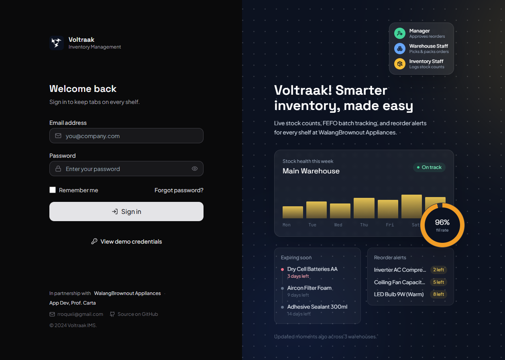
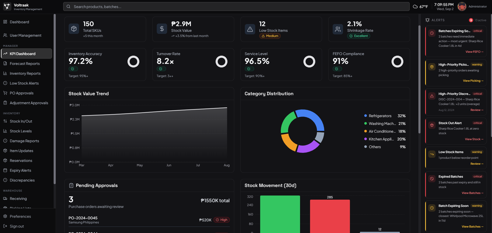

# Voltraak — Inventory Management System


Real-time inventory management, stock reconciliation, and FEFO-enforced batch tracking — built to replace a manually maintained spreadsheet that could no longer support a 35% year-over-year sales growth curve.

---

## Overview

Three operational failures drove this build:

| Problem | Root Cause | Solution |
|---|---|---|
| Panic-driven purchasing during peak demand | No real-time sales velocity data; reactive replenishment | Automated Reorder Point (ROP) calculation with demand forecasting |
| 73% stock shrinkage rate (45 recorded vs. 12 physical units) | No real-time movement tracking or reconciliation cycle | Daily physical count reconciliation with automatic variance alerting |
| ₱15,000+ per-incident expiry write-offs | LIFO picking habit, no batch or lot tracking | System-directed FEFO picking with a batch expiry state machine |

For the full problem statement, success metrics, and release plan, see [`docs/PRD.md`](docs/PRD.md).

---

## Design





---

## Architecture

The system is a **modular monolith**: a single deployable Laravel backend partitioned internally by business domain, paired with a React SPA.

| Layer | Stack | Role |
|---|---|---|
| Frontend | React 18, Vite, Tailwind CSS | Role-scoped SPA with mock/API toggle and light/dark theming |
| Backend | Laravel (PHP), MVC + Controller-Service-Repository | REST API organized into four business modules |
| Database | MySQL | Inventory, transactions, batches, purchase orders, users |
| Infrastructure | Docker Compose, Nginx, Redis | Containerized development environment |

**Backend modules:** Inventory, Procurement, Reporting, User Management. Each maps to a physical folder under `backend/app/Modules/` — no cross-module folder sharing.

**Development mode:** The frontend runs against mock data by default (`VITE_DATA_SOURCE=mocks`) and switches to the real Laravel API via environment variable. This lets frontend and backend development proceed independently.

See [`docs/Architecture.md`](docs/Architecture.md) for the full system overview, non-functional requirements, and environment setup.

---

## Roles

Three roles with server-side enforcement and client-side route guards:

| Role | Scope |
|---|---|
| Warehouse Staff | Receiving, FEFO picking, discrepancy reporting — mobile-optimized interfaces |
| Inventory Staff | Stock in/out, batch management, reservations, expiry monitoring |
| Manager | KPI dashboard, forecasting, PO approvals, reporting |

---

## Tech Stack

**Frontend**
- React 18, React Router v6
- Vite 5
- Tailwind CSS, tailwind-merge, clsx
- Recharts
- Lucide React
- Vitest, Testing Library

**Backend**
- Laravel (PHP)
- MySQL
- Docker Compose, Nginx, Redis

**Tooling**
- ESLint, Prettier
- Git / GitHub

---

## Getting Started

**Frontend only (mock data, default):**
```bash
cd frontend
npm install
npm run dev
```

**Full stack (requires Docker):**
```bash
# Set data source to real API
# In frontend/.env: VITE_DATA_SOURCE=api

docker compose up
cd frontend && npm run dev
```

**Run tests:**
```bash
cd frontend
npm run test       # watch mode
npm run coverage   # single run with coverage
```

---

## Documentation

All project documentation lives in [`docs/`](docs/). Suggested read order:

| Document | Contents |
|---|---|
| [PRD](docs/PRD.md) | Problem statement, goals, success metrics, release plan |
| [Architecture](docs/Architecture.md) | System overview, modules, roles, non-functional requirements |
| [Frontend](docs/Frontend/) | Stack, routing, component structure, styling, pages |

---

## Team

| GitHub | Role |
|---|---|
| [Dekxisosta](https://github.com/Dekxisosta) | Project Lead & Frontend Lead |
| [brtbrt123](https://github.com/brtbrt123) | Full-stack Lead & QA Engineer |
| [SHUBARUUU](https://github.com/SHUBARUUU) | Backend Lead  |
| [LiaKyutie](https://github.com/LiaKyutie) | Frontend Developer |
| [RylineAzurin](https://github.com/RylineAzurin) | Support Developer |

---

Built for **WalangBrownout Appliances**
